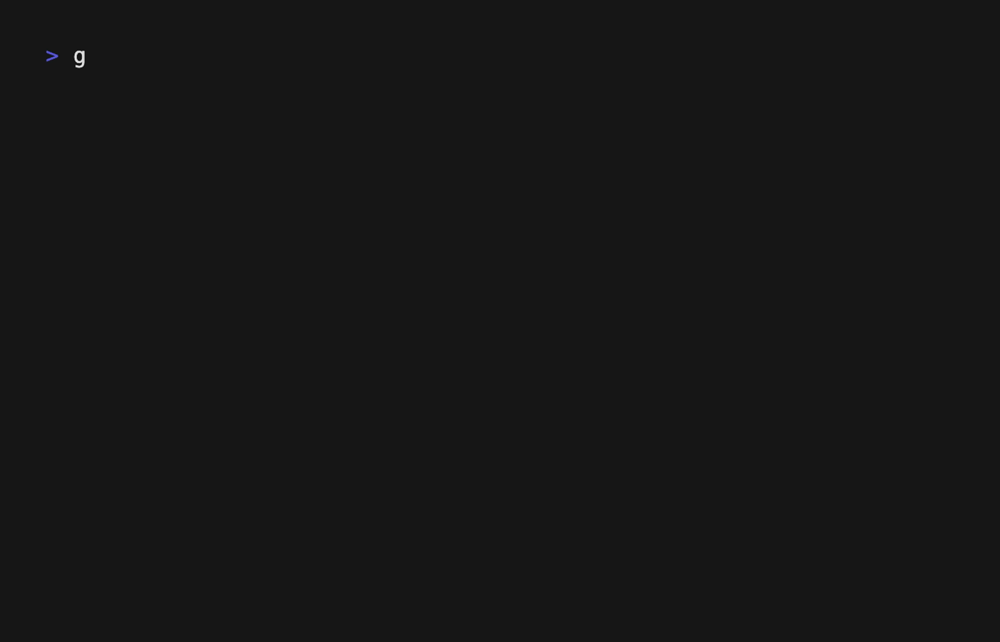

# CandleStick Bubble



A financial charting bubble using the BubbleTea framework - this bubble provides an candlestick chart visual.

## Features
- Real-time candlestick chart rendering
- Automatic price scaling
- Color-coded bullish/bearish indicators
- Dynamic date axis labeling

## Known Bugs
- none ... for now

# Simple Usage in Go

## Keybindings
- `q` - Quit application
- `u` - Update/refresh chart data

```go
package main

import (
	"fmt"
	"os"

	tea "github.com/charmbracelet/bubbletea"
	candleStick "github.com/nick-popovic/custom-bubbles/candleStick"
)

type model struct {
	chart candleStick.Model
}

func initialModel() model {
	return model{
		chart: candleStick.Model{
			Candlesticks: candleStick.GenerateSampleData(),
		},
	}
}

func (m model) Init() tea.Cmd {
	return nil
}

func (m model) Update(msg tea.Msg) (tea.Model, tea.Cmd) {
	var (
		cmd  tea.Cmd
		cmds []tea.Cmd
	)

	switch msg := msg.(type) {
	case tea.KeyMsg:
		switch msg.String() {
		case "q", "ctrl+c":
			return m, tea.Quit
		}
	}

	// Update components
	_, cmd = m.chart.Update(msg)
	cmds = append(cmds, cmd)
	return m, cmd
}

func (m model) View() string {
	return m.chart.View()
}

func main() {
	p := tea.NewProgram(
		initialModel(),
		tea.WithMouseCellMotion(),
		tea.WithAltScreen(),
	)

	if _, err := p.Run(); err != nil {
		fmt.Printf("Error running program: %v\n", err)
		os.Exit(1)
	}
}
```